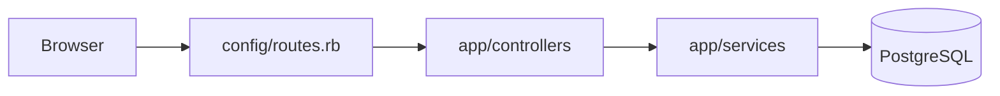
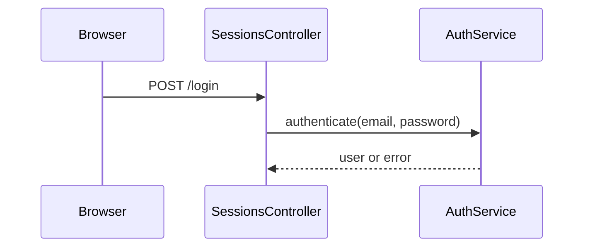

# OwlMap document templates

Fill these from the module summaries. Keep headings in this order. Write prose
in the requested `--lang`; keep code names exactly as in the source. Omit a
section only if there is genuinely nothing to say, and say so in one line.

## ARCHITECTURE.md

````markdown
# Architecture

## Summary
One short paragraph: what the system does and its overall shape (monolith, API + SPA, CLI, library…).

## Tech stack
- Languages, frameworks, datastores, notable libraries — only what you saw in manifests or code.

## Components
- **[app/models](modules/app-models.md)** — what it does, where it lives.

## How data moves
The main path a request, job or command takes through the components, in 3–6 sentences.

## External services
- Service — what it is used for — where it is configured (never the secret itself).

## Diagram

````

## FLOWS.md

````markdown
# Key flows

## Signing in
When a user submits the login form.

1. `POST /login` is routed to `SessionsController#create` (`app/controllers/sessions_controller.rb`).
2. …



**Watch out:** one or two pitfalls from the module risks.
````

## ONBOARDING.md

````markdown
# Onboarding

## Read these first
1. `path/to/file` — why it matters.

## Run it locally
Commands taken only from README, manifests, scripts or config you read. If none: "No setup instructions found in the repository."

## Where things live
| I want to change… | Look in… |
|---|---|
| The login page | `app/views/sessions/` |

## Questions newcomers ask
**Where are emails sent from?** …

## Handle with care
- Area — why it is risky.
````

## modules/&lt;slug&gt;.md

````markdown
# app/models

Purpose in 1–2 sentences.

## Key files
- `app/models/user.rb` — role

## Public interface
## Depends on
## Used by
## Data
## Handle with care
## Notes

<details><summary>All files in this module (N)</summary>

- `path`

</details>
````

Skip any `##` section whose list is empty.

## README.md (index)

````markdown
# <repo> — OwlMap

Generated documentation for <path or URL> at commit `<first 12 chars>`.

| Document | What it answers |
|---|---|
| [Architecture](ARCHITECTURE.md) | How does the system fit together? |
| [Key flows](FLOWS.md) | What happens when…? |
| [Onboarding](ONBOARDING.md) | Where do I start? |

**N files** in **M modules** · Ruby 120, JavaScript 40

## Modules
| Module | Files | Purpose |
|---|---|---|
| [app/models](modules/app-models.md) | 12 | First sentence of purpose. |

---
Written by OwlMap. Review before relying on it: statements marked "Unverified:" are inferences.
````
